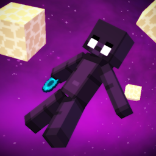

<h1 align="center">Endless Gravity 

    </a>
    

</h1>
  
Low gravity for **The End** and layered atmosphere physics for the **Overworld**.

## Features

- **The End** — reduced gravity for players, items, arrows, thrown projectiles, and falling blocks, configurable per entity type
- **Overworld atmosphere** — a continuous pressure curve (8 configurable layers) weakens gravity and muffles audio above Y 64, up to full vacuum at Y 3500
- **Fall damage** — three modes: normal, disabled, or velocity-based, with configurable scale and minimum velocity
- **Sable integration** — physics datapack (gravity, pressure, drag) generated automatically for The End and the Overworld, with configurable priorities
- **Modded config screen** — Cloth Config (bundled, no extra install) with *All*, *The End*, *Overworld*, and *General* tabs
- **Addon API** — `EndlessGravityAPI` utility (pressure, atmosphere progress, real Y projection, Sable helpers) plus the `endless_gravity:gravity_immune` entity type tag
- **Compatible** with any modded dimension or Sable sub-level; config is synced from server to client on login

## Modrinth:
https://modrinth.com/mod/endless-gravity

## Configuration

Open the mod settings from the NeoForge mod list (or *Config → Endless Gravity*). Changes apply live where possible; the audio filter and Sable datapack need a restart.

### The End

| Setting | Default | Description |
|---|---|---|
| End Gravity | ON | Master toggle for low gravity in The End |
| Player Gravity Offset | 0.055 | Upward force per tick. Higher = less gravity |
| Item Gravity Offset | 0.025 | Upward force per tick for items |
| Arrow Gravity Offset | 0.03 | Upward force per tick for arrows/tridents |
| Thrown Projectile Offset | 0.018 | Upward force per tick for thrown projectiles |
| Falling Block Offset | 0.035 | Upward force per tick for sand, gravel, anvils, dragon eggs |
| Fall Damage Mode | Velocity-Based | Normal / Disabled / Velocity-Based (shared with the Overworld) |
| Fall Damage Velocity Scale | 1.0 | Damage multiplier for velocity-based mode |
| Fall Damage Min Velocity | 0.6 | Minimum fall velocity before damage applies |
| Audio Filter Gain | 0.35 | Low-pass filter volume in The End (lower = more muffled) |
| Audio Filter Gain HF | 0.25 | Low-pass filter high-frequency volume |

### Overworld

| Setting | Default | Description |
|---|---|---|
| Enable Atmosphere | ON | Master toggle for Overworld space effects |
| Entity Gravity | ON | Apply gravity from the pressure curve to entities |
| Max Gravity Offset | 0.075 | Upward force at full vacuum (progress × max) |
| Muffle Gain | 0.01 | Low-pass gain at full vacuum (interpolated from 1.0 at ground) |
| Muffle Gain HF | 0.005 | Low-pass high-frequency gain at full vacuum |
| Atmosphere Layers | 8 layers | Altitude → pressure pairs: `-64:1.25, 64:1.0, 400:0.5, 900:0.2, 1200:0.08, 1800:0.01, 2500:0.001, 3500:0.0` |

## Addon API

`EndlessGravityAPI` (Java, `dinner.dev.endless_gravity.EndlessGravityAPI`) provides:

- `getPressure(y)` / `getAtmosphereProgress(y)` — read the configured pressure curve
- `getAtmosphereOffset(y)`, `getAtmosphereMuffleGain(y)`, `getAtmosphereMuffleGainHF(y)` — derived atmosphere values
- `getRealY(entity)`, `getRealY(level, pos)` — project positions out of Sable sub-levels into global space
- `isSableLoaded()`, `isSableManaged(level)`, `isOverworldOrSable(level)` — dimension/Sable helpers
- `GRAVITY_IMMUNE` tag — add entity types to `data/endless_gravity/tags/entity/gravity_immune.json` to make them ignore low gravity in The End

All gameplay-affecting config values are synced from server to client on login via `ConfigSyncPayload`.

## Requirements

- Minecraft 1.21.1
- NeoForge 21.1+
- Cloth Config — bundled (via Jar-in-Jar), no manual install
- Sable (required)
- Create: Cosmonautics (optional — when installed, it owns Overworld gravity and Endless Gravity backs off)

## License

[Apache 2.0](LICENSE)
